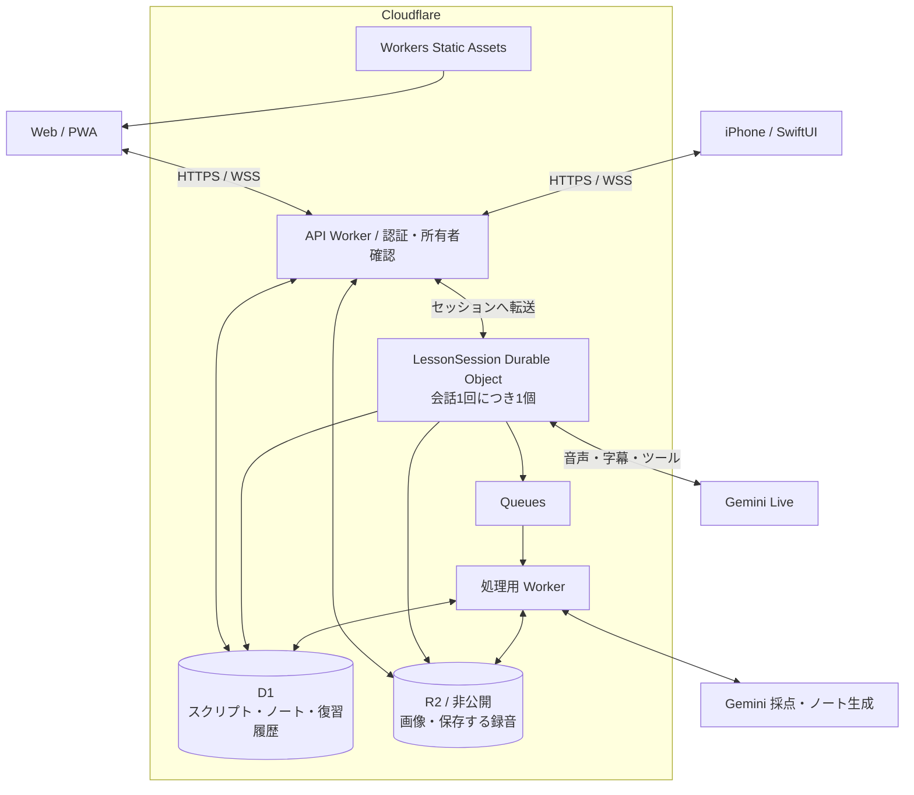

# Cloudflare 移行設計案

ステータス: 1人用の初期実装を追加済み。実機音声・保存の確認は各自の環境で行う。
この文書の図と後半の認証・Queues・iOSは拡張構成を含む。実際の公開手順は [cloudflare-setup.md](cloudflare-setup.md)。

初期実装はWorkers Static Assets / Worker、`LessonSession` と `UserProgress` のSQLite Durable Objects、D1、非公開R2。
本人専用のCloudflare Accessを使い、双方のスクリプト・指導ノート・復習状態を保存する。
圧縮録音の14日保存、容量予約を含む保存停止、期限切れ録音の再生拒否と削除、履歴画面、
ローカル復習結果の取り込みを追加した。Queues、パスキー、ネイティブiOSアプリは今後の拡張。

## 方針

Web 配信・API・会話の進行・データ保存・非同期処理を Cloudflare に集約する。
音声対話と採点には既存の Gemini を継続利用するため、AI の推論先は Google に残る。
iPhone は同じ API と WebSocket を利用するクライアントとして追加する。

推奨構成は Workers Static Assets + Workers + Durable Objects + D1 + R2。
セッション終了後のノート整理など、再試行が必要な処理に Queues を使う。
録音は圧縮して 14 日間保存する。容量に余裕がなくなった場合は新しい録音の保存を止め、スクリプト・ノートの保存を継続する。



この図は採用案であり、実測した稼働構成ではない。Workers は静的アセットと API を一緒に配信でき、Durable Objects は WebSocket の受信側・接続側として動作できる。[1][2]

## 現在の実装から引き継ぐ部分

| 現在の実装 | 移行方針 |
| --- | --- |
| `web/` の Vite / TypeScript UI | デザインと学習画面を維持し、配信先を Workers Static Assets にする |
| `server/src/index.ts` の Node HTTP / WebSocket サーバー | API Worker と Durable Object のエントリーポイントに分ける |
| `server/src/registry.ts` のプロセス内 Map | `session_id` から会話専用 Durable Object を取得する |
| `server/src/session.ts` の会話制御 | Durable Object に組み込み、進行状態の保存・復元を追加する |
| `server/src/modes/` の各コーチ | シーン会話・瞬間英作文・話し直し・復習のルールを再利用する |
| `server/src/gemini.ts` | Workers 上での接続を検証し、SDK または通信アダプターを移植する |
| `server/src/results.ts` の JSONL 読み書き | 保存先を抽象化し、D1 実装を追加する |
| `server/src/review.ts` の履歴からの復習計算 | 学習ルールを再利用し、復習状態を D1 に保存する |
| ファイルから読むプロンプト・教材 | 固定のものはビルドに含め、ユーザー編集するものは D1 に置く |
| `shared/messages.ts` の通信型 | バージョンを持つ通信仕様に整理し、Swift 用の型も生成できるようにする |

移行前のNode版では、永続保存の中心は `data/results/*.jsonl` の採点・訂正・復習結果だった。
一部の学習者スクリプトは結果に含まれるが、全モードでの学習者・モデル双方の全文保存はなかった。
Cloudflare版に「確定した発話の保存」と「履歴からスクリプト・ノートを再表示する API」を追加した。
既存の JSONL に存在しない過去の全文・録音は復元できない。

## 保存するデータ

D1 は SQLite の SQL セマンティクスを持つマネージド DB であり、履歴・ノート・復習予定の関連付けに使う。[4]
初期は環境ごとに 1 DB とし、すべてのユーザーデータに `user_id` を持たせる。

| 論理テーブル | 主な内容 |
| --- | --- |
| `users`, `credentials`, `auth_sessions` | ユーザー、タイムゾーン、パスキー、ログイン状態 |
| `sessions` | 所有者、学習モード、教材、開始・終了時刻、進行状態、利用したモデル・プロンプトの版 |
| `turns` | `session_id`, `turn_id`, 順番、発話者、本文、確定・中断の状態、録音への参照 |
| `notes` | 元の発話、改善例、説明、別表現、コロケーション、練習課題、ユーザーの追記 |
| `assessments` | 評価項目、点数、根拠となる発話、理由、評価器の版 |
| `review_cards` | 出題内容、模範解答、出典となるノート・発話 |
| `review_events` | 回答結果、試行数、回答日時、重複排除用のイベント ID |
| `review_state` | カードごとの次回日時、習熟段階、更新用の版番号 |
| `media` | R2 のキー、所有者、種類、圧縮形式、サイズ、長さ、チェックサム、録音終了時刻、保存期限、保存・削除状態 |
| `jobs`, `outbox` | 非同期処理の実行状態と、まだ配送を確認できていない処理依頼 |

これは論理モデルであり、DDL 作成時に関連・制約・インデックスを確定する。
スクリプトは発話単位で保存し、ユーザーとモデルの行を時系列に並べる。
ノートから元の発話と保存済み録音をたどれるようにする。
ユーザーの追記欄は AI の再生成対象から分け、再採点で消えないようにする。

復習一覧は `review_state(user_id, due_at)` のインデックスから取得する。
既存の復習履歴を毎回すべて読み直す処理は、移行時と再計算時に使う。
日時は UTC で保存し、「今日」の判定にはユーザーのタイムゾーンを使う。
同じ日に繰り返しても習熟段階を飛び越えない、現在の学習ルールを引き継ぐ。

R2 には画像と録音を保存する。D1 にはそのメタデータと参照キーを保存する。
初期は発話・テイク単位でサイズを制限し、長時間の PCM 全体をメモリに蓄積しない。

### 録音の保存方針（採用）

| 対象・状態 | 保存ルール |
| --- | --- |
| 学習者・モデルの録音 | 保存用に圧縮し、録音終了から 14 日間保持する |
| 期限切れの録音 | 再生を停止し、R2 の音声ファイルを自動削除する |
| 容量が逼迫した場合 | 新しい録音の保存を停止し、スクリプト・ノートの保存を続ける |
| スクリプト・ノート・採点・復習履歴 | 録音の保存期限では削除せず、長期保存する |

会話用の PCM 転送と保存用の圧縮は分ける。
圧縮形式は Web と iPhone での録音・再生、処理時間を検証して確定し、使用量は圧縮後の実サイズで計上する。
圧縮に失敗した場合も、無圧縮の音声を長期保存する代わりにテキスト・採点結果を残す。

保存期限は `expires_at = recorded_ended_at + 14 * 24 hours` として UTC で記録する。
API は期限切れ録音へのアクセスを停止し、署名付き URL の有効期限も `expires_at` を超えないようにする。
音声ファイルの削除は期限を確認する定期処理で行い、失敗した削除は再試行する。
録音用のオブジェクトキーにだけ適用する R2 の 14 日経過後の削除ルールも併用する。
R2 のライフサイクル削除は期限の瞬間には完了しないため、アプリの再生期限と物理削除の完了を分けて管理する。[12]
画像やテキストには、この録音用の削除ルールを適用しない。

容量不足時の動作は次のようにする。

- 画像・他の利用分と安全余裕を差し引いた録音用の容量予算を設ける。進行中アップロードの予約量と削除待ちの音声も含め、実際の削除確認まで使用量を減算しない。
- 初期の運用値は、容量予算の 80% で新規録音保存を停止し、70% 未満に戻ったら次のセッションから再開する。閾値は設定で変更でき、録音を保存しないモードにも固定できる。
- セッション開始時に保存モードと必要容量の予約を決め、保存前にも確認する。容量を確保できない場合は録音を残さず、会話・採点・テキスト保存を継続する。
- 保存停止への切り替えだけでは、期限内の既存録音を前倒し削除しない。既存録音はそれぞれの 14 日の期限で削除する。

録音を保存しないモードでも、採点に必要な音声は会話中に一時的に処理して、処理後に破棄する。
終了後の非同期ノート生成は、保存済みスクリプトと採点結果から実行できるようにする。
採点が未完了ならその状態を残し、音声がないのに音声評価を完了した扱いにはしない。
スクリプト・ノートの表示や復習は音声ファイルの存在に依存させず、録音が未保存・期限切れの場合は再生操作を出さない。

## 会話セッションと切断への対応

会話 1 回を `LessonSession` Durable Object 1 個に割り当てる。
同じセッションを再開するときは、同じ `session_id` へ接続する。
セッションごとに発話中の端末を 1 台とし、別端末から再開する場合は接続世代を更新して古い接続を無効にする。

Durable Object が担当するもの:

- Gemini への音声転送、返ってきた音声・字幕の配信。
- モード、出題番号、ヒント段階、発話中の状態、ツール呼び出しの順序。
- 学習結果を確定するサーバー側のルール。
- 確定した発話・結果の保存と、進行状態のチェックポイント。

**Gemini への外向き WebSocket がある間は、Durable Object の休眠を前提にできない。**
接続中の稼働時間を費用見積もりに含める。
デプロイやランタイム更新でも WebSocket は切断されうるため、終了処理だけに保存を任せない。[3][9]

進行状態は Durable Object の永続ストレージに、履歴として参照するスクリプト・ノートは D1 に保存する。
前者は再開用のチェックポイント、後者は学習記録の正本とする。
ターン・進行段階の境界で保存し、PCM の各フレームや字幕の途中経過ごとには D1 を更新しない。
切断中の未確定の発話は中断として扱い、必要なら最後の確定ターンから話し直す。

接続復帰は次の 2 層で実装する。

1. **アプリ側:** クライアントが最後に受信したイベント番号を渡し、保存済みスクリプトと現在の課題を復元する。再配送した結果はイベント ID で重複排除する。
2. **Gemini 側:** 最新の利用可能な再開ハンドルを保存し、Session Resumption / GoAway に対応する。再開できない場合は確定済みの文脈から新しい接続を開始する。[8]

再接続時に過去の音声を無条件で再送しない。
学習結果の確定はイベント ID で識別し、同じ採点・復習結果を二度反映しない。

## ノート生成・保存の整合性

会話中に必要な判定・ヒント・話し直し前のフィードバックは、その場で返す。
終了後の要約、ノート整理、追加の表現抽出は Queue に渡し、画面を閉じても処理を続けられる構成にする。
画面には `pending / processing / ready / failed` の状態を返す。

Queues は同じメッセージを複数回配送する場合がある。[7]
`(session_id, job_kind, version)` を重複排除キーとし、出力の一意制約と実行権の期限を設ける。
処理の順番に依存する場合は、DB 上の状態・版番号を確認してから適用する。
外部 AI 呼び出しの終了直後に障害が起きるケースまで、課金が必ず 1 回になるとは保証しない。

D1 の `batch()` は SQL のトランザクションとして利用できる。[5]
復習イベントの追加と復習状態の更新は、重複判定・版番号の条件も含めて原子的に行う。
古い版を前提にした更新が失敗した場合は再読込する。

D1、Durable Object のストレージ、R2、Queue の間に単一のトランザクションがあるとは扱わない。
次のように、再試行して完了できる保存手順にする。

- 結果と処理依頼を D1 の同じトランザクションで記録し、未配送の依頼を定期的に再送する。
- Durable Object には D1 への未反映イベントを保持し、イベント ID を使って再反映する。
- メディアは `pending` で登録し、R2 への保存を検証してから `ready` にする。未完了データは再試行・掃除する。
- 削除は D1 の削除状態とメディア削除ジョブで管理し、途中で失敗しても続行できるようにする。
- 録音の期限切れ削除では、関連する発話・ノート・採点・復習カードを削除しない。R2 側ですでに削除済みの場合も成功として扱い、メタデータを整合させる。

## Web と iPhone の認証・API

Cloudflare 内にアプリ側の認証処理を置く案として、パスキー / WebAuthn を第一候補にする。
検証は実績あるライブラリを使い、Workers 上での動作を事前確認する。
初期は招待制とし、追加のパスキー登録と復旧手段も用意する。
端末側のパスキー保管・同期には Apple などのプラットフォーム機能が関わる。

Web と iOS のパスキー認証は同じ WebAuthn バックエンドを利用できる。
iOS アプリと Web ドメインの対応には Associated Domains を設定する。[10]
必要になった時点で Sign in with Apple などを追加できるよう、外部 ID とアプリの `user_id` を分けて管理する。

認証後の通信は次のように設計する。

- Web は Secure / HttpOnly Cookie と、状態変更時の CSRF 対策を使う。
- iOS は短命のアクセストークンと更新トークンを使い、更新時にローテーションする。トークンは Keychain に保存する設計とする。
- API がユーザーを確定し、DB の参照・変更、メディア取得、WebSocket 接続ごとに所有者を確認する。
- WebSocket は認証済み API が発行する短命・一度限りの接続チケットを使う。ログにチケットを残さない。
- Gemini の API キーはサーバー側に置く。接続数・最大会話時間・利用量に制限を設ける。

R2 は非公開にする。ブラウザ・iPhone からの直接アップロードが必要なら、所有者を確認した API が短時間の署名付き URL を発行する。
署名付き URL は有効期限内に所持者が利用できるため、URL を永続的な公開リンクとして保存しない。
ファイルサイズや実体はアップロード完了時にも検証する。[6]
録音のアップロード許可には容量予約と保存期限を付け、完了時に期限切れなら保存を確定せず削除する。

API の例:

```text
POST   /api/v1/sessions
POST   /api/v1/sessions/:id/connect-ticket
GET    /api/v1/sessions/:id/ws
POST   /api/v1/sessions/:id/end
GET    /api/v1/sessions/:id/turns?cursor=...
GET    /api/v1/notes?cursor=...
PATCH  /api/v1/notes/:id
GET    /api/v1/review/today
POST   /api/v1/media/upload-intents
POST   /api/v1/media/:id/complete
GET    /api/v1/media/:id/access
GET    /api/v1/jobs/:id
```

採点や復習段階はサーバーが決める。クライアントは回答・操作を送る。
WebSocket メッセージは `protocol_version`, `session_id`, `event_id`, `seq` を持つ仕様に整理する。
REST は OpenAPI、イベントは JSON Schema などで定義し、TypeScript と Swift の型に反映する。

## iPhone 対応

まず既存 Web をレスポンシブ化・PWA 化して、iPhone 実機でマイク・再生・復習履歴を検証する。
ネイティブアプリは SwiftUI を推奨する。音声部分には AVAudioEngine / AVAudioSession を使う案とし、
録音・再生に加えてエコー処理を実装する。AVAudioEngine には音声通話向けの voice processing がある。[11]

バックエンドは共通化し、iOS 側で次を追加する。

- 入出力音声をサーバーとの通信形式に変換する。既存の入力 16 kHz / 出力 24 kHz PCM を最初の互換仕様とする。
- 着信、イヤホン切り替え、Wi-Fi / モバイル回線切り替え時の中断・復帰を実装する。
- 初期はフォアグラウンドでの会話を対象とし、バックグラウンド移行時は安全に一時停止する。
- スクリプト・ノートを端末にキャッシュし、閲覧はオフラインでも可能にする。
- AI との音声会話はオンラインで行う。オフライン編集を追加する場合は変更 ID と版番号で競合を扱う。

Web と iPhone で同じアカウントを使い、PC の練習で生まれたノートを iPhone の復習に反映することを、最初の同期の完成条件にする。

## 移行順序と完了条件

### 1. 音声接続の小さな実証

Durable Object から Gemini Live へ接続し、現在の音声・ツール呼び出しを動かす。
SDK の Workers 互換性、接続再開、会話の遅延、メモリ使用量、会話時間当たりの費用を確認する。
10〜30 分の会話、ツールだけで終わるモデル応答、割り込み、回線切断、デプロイをまたぐ再接続を検証対象にする。
費用は Gemini 利用量、Durable Object 稼働時間、保存・操作量を分けて見積もる。[9]

### 2. 保存先の切り替えと Web のリモート化

保存処理をインターフェースで分離し、D1 / R2 実装を追加する。
学習者・モデル双方のスクリプト保存、ノートの再表示、復習状態の更新を揃える。
認証を組み込み、Workers Static Assets / API / Durable Objects へ移行する。
終了後のノート生成に Queue と再試行処理を接続する。

既存 JSONL はバックアップを取り、所有者を指定してインポートする。
`eventId` がある行はそれを使用し、ない行は元ファイルの識別子・行番号・内容ハッシュを組み合わせて再実行時の重複を防ぐ。
復習状態を再構築し、元の履歴と次回の出題内容を照合してから切り替える。

完成条件は、ブラウザを閉じて別端末でログインしても全文・ノート・次回復習が確認できること。
ユーザー間の分離、再接続時の重複防止、保存失敗後の再試行、削除・エクスポートも確認する。
録音の圧縮と 14 日の期限、容量不足時の保存停止・復帰、音声が未保存・削除済みでもスクリプト・ノート・復習が使えることを確認する。
既存の学習ルールのテストを引き継ぎ、クラウド固有の整合性と認証の検証を追加する。

### 3. iPhone アプリ

共通 API を使って SwiftUI の会話・スクリプト・ノート・復習画面を作る。
音声処理、パスキー、接続復帰、ローカルキャッシュを実装する。
PC で練習した後に iPhone で復習し、結果が PC に戻るところまでを実機確認する。

この段階までは検索専用 DB やベクトル検索を必須にしない。
利用量や検索要件が具体化したら追加を判断する。

## 参照した公式資料

以下は設計根拠として確認した資料。料金・制限・SDK の互換性は実装時にも再確認する。

1. Cloudflare Workers Static Assets: `https://developers.cloudflare.com/workers/static-assets/`
2. Cloudflare Durable Objects / WebSockets: `https://developers.cloudflare.com/durable-objects/best-practices/websockets/`
3. Cloudflare Durable Object lifecycle: `https://developers.cloudflare.com/durable-objects/concepts/durable-object-lifecycle/`
4. Cloudflare D1: `https://developers.cloudflare.com/d1/`
5. Cloudflare D1 Database API / batch: `https://developers.cloudflare.com/d1/worker-api/d1-database/`
6. Cloudflare R2 presigned URLs: `https://developers.cloudflare.com/r2/api/s3/presigned-urls/`
7. Cloudflare Queues delivery guarantees: `https://developers.cloudflare.com/queues/reference/delivery-guarantees/`
8. Gemini Live session management: `https://ai.google.dev/gemini-api/docs/live-api/session-management`
9. Cloudflare Durable Objects pricing: `https://developers.cloudflare.com/durable-objects/platform/pricing/`
10. Apple / Meet passkeys: `https://developer.apple.com/videos/play/wwdc2022/10092/`
11. Apple / What's New in AVAudioEngine: `https://developer.apple.com/videos/play/wwdc2019/510/`
12. Cloudflare R2 object lifecycles: `https://developers.cloudflare.com/r2/buckets/object-lifecycles/`
